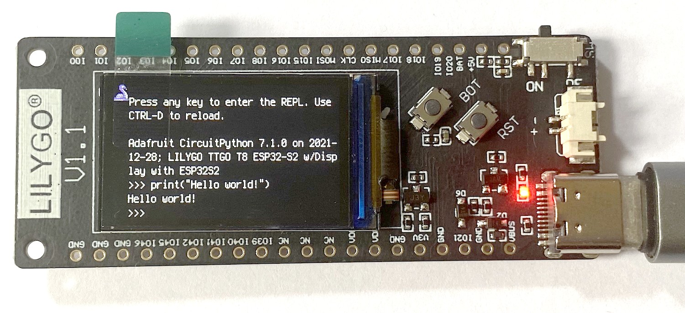
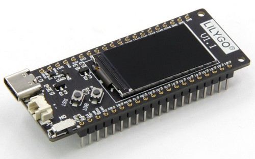
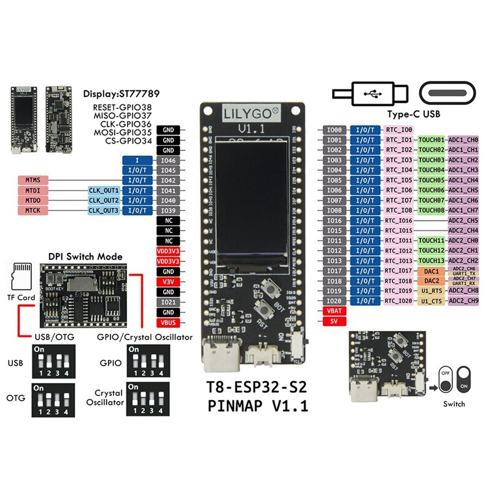
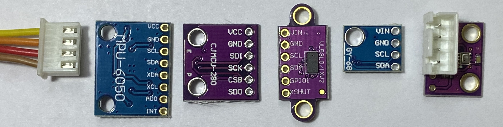
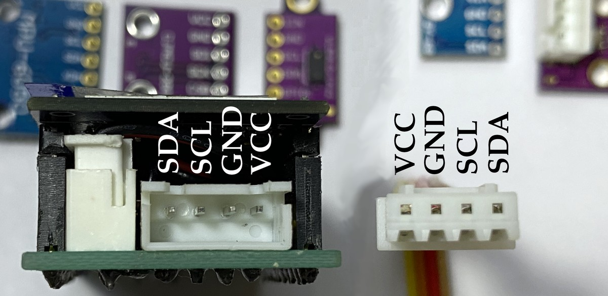
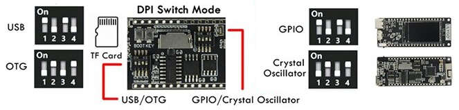

# ssis:bit

AIO microcomputer solution with CircuitPython, display and battery for SSIS students.



## Hardware


### T-Display

CircuitPython supports [more than 200 different boards](https://circuitpython.org/downloads). Locally available are the [TTGO T-Display](https://circuitpython.org/board/unknown/?unknown_id=lilygo_ttgo_tdisplay_esp32_16m) and the [TTGO T8 ESP32-S2 ST7789](https://circuitpython.org/board/lilygo_ttgo_t8_s2_st7789/) at several online stores. The board includes the powerful 240MHz CPU, 4MB Flash and 8MB PSRAM, a 1.14" ST7789 display, a microSD card slot for virtually unlimited local data storage, battery connector 1.25mm JST with charge controller and regular USB-C connector. And buildin WiFi, of course. In case of the T8 it even has a microSD card slot.

### T8



The planned adapterplate adds a 3-way button for input, place to hold the little 500 mAh battery and interface for I2C with regular 2.54mm 4pin JST XH as well as the small Stemma QT 1mm JST SH connector (QWIIC).

### Documentation by LilyGo or TTGO

Parts of the documentation for this board can be found under both brand names LilyGo and TTGO. The main board resembles an [LilyGo T8](https://github.com/Xinyuan-LilyGO/LILYGO-T8) with a [ESP32-S2](https://github.com/Xinyuan-LilyGO/ESP32_S2) CPU but an added ST7789 display. So the schematic is found under [T-Display S2](https://github.com/Xinyuan-LilyGO/LilyGo-T-Display-S2) even though it is not sold as such. Here are some repositories for further informations:

- https://github.com/Xinyuan-LilyGO/LilyGo-T-Display-S2
- https://github.com/Xinyuan-LilyGO/LilyGO-T-DisplayGD32
- https://github.com/Xinyuan-LilyGO/LILYGO-T-display-RP2040
- https://github.com/Xinyuan-LilyGO/TTGO-T-Display
- https://github.com/Xinyuan-LilyGO/LILYGO-T8
- https://github.com/Xinyuan-LilyGO/ESP32_S2

## Software


The ssis:bit runs [CircuitPython](https://circuitpython.org/) and can be easily programmed with the [Mu Editor](https://codewith.mu/en/). There is a lot to learn on [Adafruit with CircuitPython]() and with their great libraries there is less frustration getting things started.

## GPIO

This document from LilyGO documents the pins of the T8.



In CircuitPython the following pins are available"

``` py
import board
dir(board)
['__class__', '__name__', 'BATTERY', 'DISPLAY', 'IO0', 'IO1', 'IO11', 'IO12', 
'IO13', 'IO15', 'IO16', 'IO17', 'IO18', 'IO19', 'IO2', 'IO20', 'IO21', 'IO3', 
'IO39', 'IO4', 'IO40', 'IO41', 'IO42', 'IO45', 'IO46', 'IO5', 'IO6', 'IO7', 
'IO8', 'IO9', 'LCD_BCKL', 'LCD_CLK', 'LCD_CS', 'LCD_D_C', 'LCD_MOSI', 
'LCD_RST', 'PE_POWER', 'RX', 'RX1', 'SD_CLK', 'SD_CS', 'SD_MISO', 'SD_MOSI', 
'TX', 'TX1', 'board_id']
```

To find he assigned pins we running
``` py
"""CircuitPython Essentials Pin Map Script"""
import microcontroller
import board

board_pins = []
for pin in dir(microcontroller.pin):
    if isinstance(getattr(microcontroller.pin, pin), microcontroller.Pin):
        pins = []
        for alias in dir(board):
            if getattr(board, alias) is getattr(microcontroller.pin, pin):
                pins.append("board.{}".format(alias))
        if len(pins) > 0:
            board_pins.append(" ".join(pins))
for pins in sorted(board_pins):
    print(pins)
```

And get

``` py
board.BATTERY board.IO9
board.IO0
board.IO1
board.IO11 board.SD_MOSI
board.IO12 board.SD_CLK
board.IO13 board.SD_MISO
board.IO15
board.IO16
board.IO17 board.TX1
board.IO18 board.RX1
board.IO19
board.IO2
board.IO20
board.IO21
board.IO3
board.IO39
board.IO4
board.IO40
board.IO41
board.IO42
board.IO45
board.IO46
board.IO5
board.IO6
board.IO7
board.IO8
board.LCD_BCKL
board.LCD_CLK
board.LCD_CS
board.LCD_D_C
board.LCD_MOSI
board.LCD_RST
board.PE_POWER
board.RX
board.SD_CS
board.TX
```

Mapped out it looks like this:


- 43 GPIO (0-21 (22) and 26-46 (21))
- 7 not exposed at all (26 to 32)
- 6 not exposed for LCD (33 to 38)
- 2 exposed as USB/OTG (43 and 44)
- 3 further not exposed (9 battery, 10 SD_CS and 14 PE_POWER)
- 3 exposed for SD read (11 to 13)
- 22 GPIO ready to use (43-21 as 0-8, 15-21, 39-42, 45-46)

The plan is:

- 2 will be used for I2C
- 3 will be used for input buttons (0, 1, 2)

### I2C connector

The order of pins in the 1mm QUIIC connector is different from the order of the 4 pins found in virtually every hobby board with 2.54mm pins:



Therefore we can just solder a 4-pin JST XH 2.54 mm pitch (0.1 ") connector to any of these boards and then use a standard XH-4 cable to connect to our ssis:bit without worrying about polarity or correct pin order:



## Installation

Connect your T8 ST7789 to a USB port of your computer and determine the port. You can do this by right-click on the Windows symbol > Device Manager > ports (COM & LPT) and there you'll find ```USB-SERIAL CH340 (COM5)```. Here COM5 would be your serial port. Open ```cmd``` or ```powershell``` and navigate to the folder with the esptool.exe and firmware.bin.

- Check your board with `esptool.exe --port COM5 flash_id`
- Erase the flash `esptool --port COM5 erase_flash`
- Flash the new firmware with `esptool.exe --port COM5 --baud 460800 write_flash -z 0x0 firmware.bin`

CircuitPython should now be running on your T8. Now you have to switch the USB-C port from the serial CH340 interface to the native USB interface of the ESP32-S2. Therefore you need to change the DIP switches on the bottom of the board:



After that the board will be detected as a USB drive named "CIRCUITPY". You can just upload any program and it will reset the machine and start the code.py in the root folder.

``` py
Adafruit CircuitPython 7.1.0 on 2021-12-28; LILYGO TTGO T8 ESP32-S2 w/Display with ESP32S2
>>> 
```

Here you can directly try your first *hello_world*.

``` py
>>> print("Hello world!")
Hello world.
```

### Original sources with updates

First he have to obtain the two programs and the firmware.

#### esptool.py

The __esptool.py__ is the software provided by esp to upload the firmware to their SoCs. I got mine from the Arduino installation at the path `C:\Users\You\AppData\Local\Arduino15\packages\esp32\tools\esptool_py\2.6.1\ ` . You can download the latest version from github:

[https://github.com/espressif/esptool](https://github.com/espressif/esptool)

#### firmware

The latest MicroPython firmware for the ESP32 can be found on [micropython.org](https://micropython.org/download/esp32/). This firmware does not include a driver for the ST7789 display. You have several options to include the display library.

## Motivation and History

More will be updated in the [docs/history](docs/history.md) document, but the idea is from 2020 with the [T-Display](https://github.com/kreier/t-display) board. Similar idea: Not just the Microcomputer but included power supply (LiPo), display (just 240x135 color) and input device (not keyboard, but 3 buttons) to have it always with you and ready to use.

A major challenge to get students use more of the microcomputers like Arduino, Raspberry Pi or micro:bit is the need for 3 more accessories to use them:

1. Input (keyboard, accelerometer, buttons, microphone)
2. Output (display, LEDs, matrix, beeper, serial back to PC)
3. Power supply (LiPo battery, AC adapter)

Some of these challenges are solved partially with the micro:bit - but limited in the end with just 2 buttons as input and a 5x5 red LED matrix as output. And the power adapter with 2 AAA batteries is not physically connected, making the solution less robust. Advantages with the Lilygo T8 ST7789:

1. AIO solution with 3 button input, 240x135 color display output and small LiPo battery
2. Standardised QWIIC / STEMMA QT 1mm JST SH adapter for I2C sensors and IO
3. Standardised 2.54mm/0.1" JST XH-4 connector for I2C
4. SD Card with GB of space for websites, data, images
5. WIFI build in to serve as an AP students can connect to, or to connect to the Internet
6. USB-C for charging and simple upload of programs to the `CIRCUITPY` folder
7. REPL - get starting programming right away!
8. Even debugging is possible with the small LCD display - shows the line of the bug
